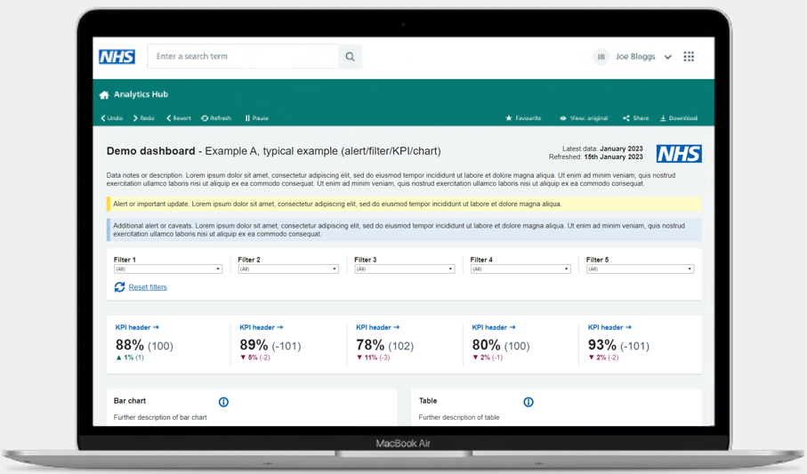
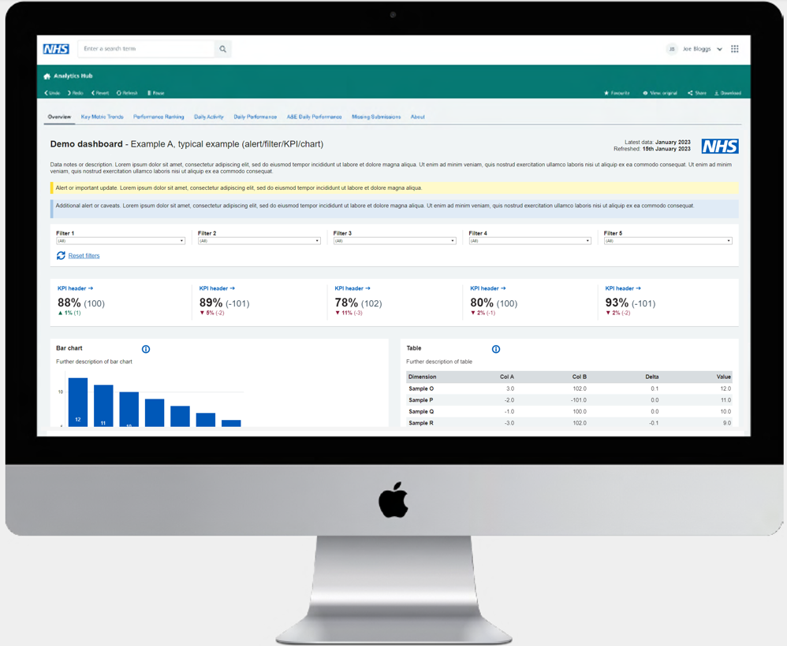
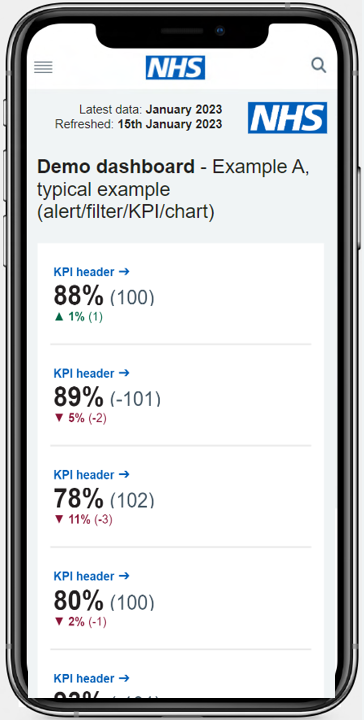

# Setting up layout & navigation

Where NHS England dashboards are embedded into web pages it is best to make use of the existing web wrapper, this makes use of the 'showing sheets as tabs' Tableau navigation function.

Where this web wrapper is not available, it is best to use Tableau navigation buttons instead.

## Web wrapper

Our web wrapper
{data-title="Web wrapper" data-caption-position="top" data-gallery="wrapper"}

Our Tableau developers should build their dashboard pages from beneath the web wrapper navigation tabs. In the image below, the top part in grey overlay is the web wrapper, the rest is built in Tableau.
{data-title="The web wrapper meets Tableau" data-caption-position="top" data-gallery="wrapper"}

## Navigation

**Tabs as navigation**

Including default tabs is the quickest, easiest way to allow users to navigate the dashboard. They are used in many products so users will be accustomed to using them naturally and they maximise space simply. We would advise this method. It is ideal not to have more than eight tabs.

**KPIs / Visualisation as navigation**

Users should be able to navigate through dashboards by clicking on the KPIs or on any areas within the visualisations.

**Hyperlinks**

Add hyperlinks to websites with more information (such as the HES Data Dictionary or published data on the NHS England website) or on the cover/about page.

**Buttons as navigation**

Buttons could be used as a navigation, but we recommend using tabs wherever possible.

> {: width="25%" data-gallery="button" align=right}

> **How to add a button on the dashboard**

> You can use the 'button' object on the bottom left hand side

>  1. Click and drag it to the dashboard canvas.
>  2. Click the 'edit button' to define its attributes.
>     Such as which page will be navigated to on clicking this button.
>  3. You can add this button as an image or as a text.
>  4. Test it in the presentation mode to make sure it is working correctly.

!!! note "Useful links"

    - For more info on Buttons
[comment]: <> (need actual links to add in!!)

## Dashboard layout

> Layout done perfectly, will be invisible to the user. Layout done badly may be the only thing they see.

The following page template is used across the product, particularly for report pages. it is best practice to use a Z-formation, like how you would read a book.
For more details see [here](principles.md#visual-hierarchy).

<figure markdown>
  {data-title="Z layout examples" data-caption-position="top" data-gallery="z"}
</figure>

!!! danger "General rules"

    - 32px margin on left and right sides of the dashboard.

    - 16px padding on top, bottom, left and right of the card.

    - 32px spacing between cards on the dashboard.

    - Minimum font size 11px or 11pt.

    - Utilise various weights to establish a hierarchy. Be consistent in size, boldness and colour.

    - Workbook name should be in title case.

    - Filters should be in sentence case.

    - Place filters horizontally under the dashboard title if you only have a few.

    - Dashboard background colour #F0F4F5 (NHS Grey 5).

    - If we are using multiple cards in a single row (side by side) make sure they are of the same height.

    - If the viz is going to show more data (more lines/bars) use the full wifth card so it helps the user to digest information quickly.

    {data-title="Full page layout" data-caption-position="top" data-gallery="full"}

### Header section
<!-- <figure markdown>
  {data-title="Page header layout" data-caption-position="top" data-gallery="page"}
</figure> -->

The top of the page should be split into two main sections.
In Tableau, these two sections would each be in a separate container sat within an overall top of page horizontal container.

On the left should be the dashboard title, subtitle if used, a brief dashboard description and an alert/message banner if needed.
This section should be no more than 1200px.

On the right should be the NHS logo and any data refresh information. This section should be a fixed width of 300px.

[comment]: <> (add in NHS App dashboard example pic + text above as caption!)

<figure markdown>
  { data-title="Page header example" data-description=".custom-desc-page" data-caption-position="left" data-gallery="page"}
  <figcaption>Click image for more details</figcaption>
</figure>

<ol>
  <li>Entire horizontal container, contains two objects (1.1 & 1.2):
    <ol>
      <li>The date sheet should be of the fixed width of 300px.</li>
      <li>A second horizontal container should be set to variable width. Inside this container is:
        <ol>
          <li>A variable width blank.</li>
          <li>The heading area and the blurb on the left side should be set to the maximum width of 1200px.</li>
          <li>Horizontal container with light yellow background (#FFFACA), 16px for top & bottom padding, containing:
            <ol>
              <li>Blank of 8px with dark yellow background (#FDDC31).</li>
              <li>24px Bulb/exclamation icon.</li>
              <li>Text box for message/alert.</li>
            </ol>
          </li>
        </ol>
      </li>
    </ol>
  </li>
</ol>

**Titles and subtitles**

For easy identification and navigation, every tab should show the workbook title (NHS Grey1, 24pt, Arial, title case), and the subtitle which matches the tab name (Black, 24pt, Arial, sentence case), with a black hypen with spaces either side between the two names. A brief description of what the tab is showing can be added.

**Data refresh date**

The data refresh date should be shown on the right side of the title and subtitle.

**Margins**

Left, top and right margins should be 32 pixels. The bottom of each page should show an NHS Blue line (height = 2 pixels) and contact information.
Additional information on latest data available is an optional extra.

**NHS identity**

NHS logo should be 75 x 40 pixels, with a top and right hand side margin of 32 pixels.

!!! note "Useful tips for header section"

    1. Use either tabs or buttons for navigation purposes. Not both. This repetition makes the header look busy.

    2. Do not use the 'Hide note' functionality in the header section.

    3. Avoid using icons/images in the header area to redirect users to different dashboards.

        - Clicking on icons without labels is not intuitive.

        - Multiple icons increases visual clutter.

        - Instead move the icons next to relevant / related visualisations outside of the header section.
    
    4. Add links to related dashboards and supporting webpages to an 'information & guidance' page or a 'related dashboards' page.

    { data-title="Page header example" data-gallery="header"}

      Tableau template download link
[comment]: <> (need actual links to add in!!)

## Adaptive webview or fixed view

**Fitting**

The sheet size that fits in a Tableau workbook during development is different from what it will look like once published, and may be different from how it will fit on screens with different resolutions.

| If the smallest iframe dimension is... | This device layout appears... |
|----------------------------------------|-------------------------------|
| 500 pixels or less                     | Phone                         |
| Between 501 and 800 pixels             | Tablet                        |
| Greater than 800 pixels                | Desktop                       |

**Scroll bars**

In general you should try to avoid scroll bars in your products. However, where the use of a scroll bar is necessary, ensure that there is only one scroll bar on your dashboard either vertical or horizontal.

Not two vertical scroll bars (one applied for the browser and the second one applied to a component within the dashboard).

<figure markdown>
  {: width="63%" data-gallery="scroll"}
</figure>

### Control overall dashboard size

**Fixed**

{: height="100px" data-title="Fixed layout" data-caption-position="top" data-gallery="layout" align=right}

- The dashboard remains the same size, regardless of the size of the window used to display it.
If the dashboard is larger than the window, it becomes scrollable.

- These dashboards let you specify the exact location and position of objects, which can be useful if there are floating objects.

- These will load faster because they're more likely to use cached version on the server.

**Range**

{: height="100px" data-title="Range layout" data-caption-position="top" data-gallery="layout" align=right}

- The dashboard scales between minimum and maximum sizes that you specify.

- If the window used to display the dashboard is smaller than the minimum size, scroll bars are displayed.
If it is larger than the maximum size, white space is displayed.

- Use this setting when you are designing for two different display sizes that need the same content and have similar shapes - such as small and medium sized browser windows.

**Automatic**

{: height="100px" data-title="Automatic layout" data-caption-position="top" data-gallery="layout"  align=right}

- The dashboard automatically resizes to fill the window used to display it.

- Use this setting if you want Tableau to take care of resizing. For best results, use a tiled dashboard layout.

 

### Different device views on Tableau

Tableau gives you the option to create different views based on a user's device.

<figure markdown>
  {: width="70%" data-gallery="tableau_layout"}
</figure>

??? tip "Desktop (range above 800 pixels)"

    - If the user is looking at the dashboard in a browser that is less than 1200 pixels width then a horizontal scroll bar should appear.

    - If the user is viewing the dashboard in a browser that is wider than 1920 pixels, then the dashboard has to be centre aligned to the screen by leaving space on either side.

    - Based on the screen size, the width of the elements (filter dropdowns, KPIs) should change but not the space between them.

    - Five filters per row.

    - Six KPIs per row.

    {: width="45%" data-title="Laptop range layout" data-caption-position="top" data-gallery="range" align=left}
    {: width="45%" data-title="Desktop range layout" data-caption-position="top" data-gallery="range" align=right}

??? tip "Tablet (range between 501 - 800 pixels)"

    {: width="45%" data-title="Tablet range layout" data-caption-position="top" data-gallery="range" align=right}

    - If the user is viewing the dashboard in a screen range between 501 - 800 pixels, then the tablet layout should be populated.

    - Three filters per row.

    - Four KPIs per row.

    - Please note, as users will not be able to do the hover on touch devices (mobile & tablet), avoid tooltips and hover actions.
    It is advisable to complete you dashboard before setting this functionality up, otherwise each time you make chnages to the dashboard, they need to be done in both views.

    - Based on the screen size, the width of the elements (filter dropdowns, KPIs) should change but not the space between them.

??? tip "Mobile (range under 501 pixels)"

    {: width="35%" data-title="Mobile range layout" data-caption-position="top" data-gallery="range" align=right}

    - If the user is viewing the dashboard in a screen range of 500 pixels or fewer, then the mobile layout should be populated.

    - Three filters per row.

    - Four KPIs per row.

    - Although we have identified a few patterns/examples on how we can simplify and present the data on mobile devices, we should still look at each dashboard individually to suggest any recommendations or simplify further.

    - Because of the limited space on mobiles, wherever possible please present only key important information.
    If the user requires a deeper analysis we will ask them to visit the desktop version.

    - Do not put graphs side by side.

    - Please note, as users will not be able to use the hover on touch devices (mobile & tablet) avoid tooltips and hover actions.
    It is advisable to complete your dashboard before setting up this functionality, otherwise each time you make changes to the dashboard, they need to be done in both views.

     

    - An example, shown below, for simplifying multiple visualisations with complex data for mobile layouts, is to show only the highest values in a tabular format rather than showing the visualisation.

    {: width="63%" data-title="An example desktop complex visualisation" data-caption-position="top" data-gallery="visualisation" align=left}
    &#8600;
    {: width="20%" data-title="Simplified mobile visualisation" data-caption-position="top" data-gallery="visualisation" align=right}

     

    - The example below, shows how complex tabular data can be simplified for mobile devices. Rather than showing mulitple days in the table, we could give an option for the user to select a day in additional filters.

    {: width="43%" data-title="An example desktop complex table" data-caption-position="top" data-gallery="visualisation" align=left}
    &#8594;
    {: width="35%" data-title="Simplified mobile table" data-caption-position="top" data-gallery="visualisation" align=right}

     

    - Further simplifications could be to limit charts to the top three by default with the option to show all.

    {: width="43%" data-title="An example desktop long chart" data-caption-position="top" data-gallery="visualisation" align=left}
    &#8594;
    {: width="35%" data-title="Simplified mobile top 3 chart and expanded view" data-caption-position="top" data-gallery="visualisation" align=right}
