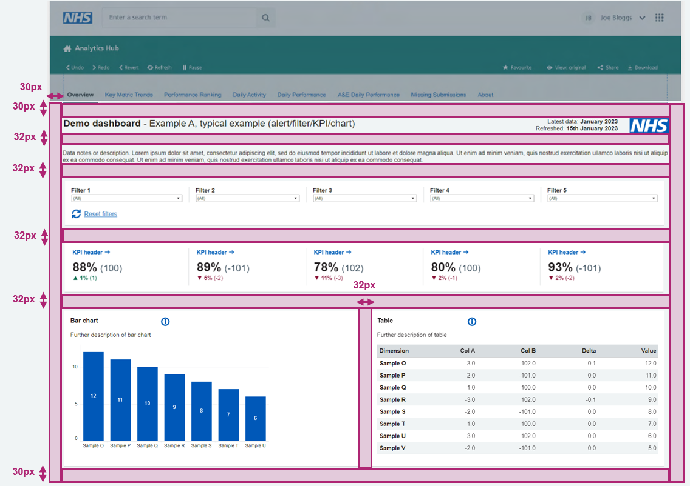
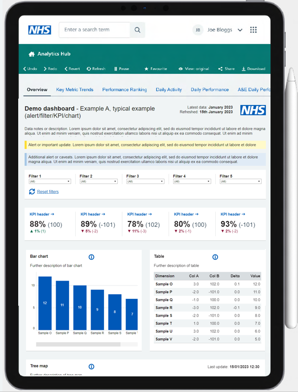

## General layout
> Layout done perfectly, will be invisible to the user. Layout done badly may be the only thing they see.

The following page template is used across the product, particularly for report pages. it is best practice to use a Z-formation, like how you would read a book.
For more details see the [principles page](principles.md#visual-hierarchy).

{data-title="Z layout examples"  data-caption-position="top" data-gallery="z"}

!!! danger "General rules"

    - 32px margin on all sides of the dashboard as per <a href="https://www.england.nhs.uk/nhsidentity/identity-guidelines/nhs-logo/">NHS England identity guidelines.</a>

    - 16px padding on top, bottom, left and right of cards. For further information visit the [cards page](cards.md).

    - 32px spacing between cards on the dashboard.

    - Minimum font size 11px or 11pt.

    - Utilise various weights to establish a hierarchy. Be consistent in size, boldness and colour.

    - All text should be sentence case.

    - Dashboard background colour #F0F4F5 (NHS Grey 5).

    - If the viz is going to show more data (more lines/bars) use the full width card so it helps the user to digest information quickly.

???- tip "Example dashboard layout annotated with padding and spacing"
    {data-title="Full page layout" data-caption-position="top" data-gallery="full"}

### Header
- The top of the page should be split into two main sections.
- In Tableau, these two sections would each be in a separate container sat within an overall top of page horizontal container.
- On the left should be the dashboard title, subtitle if used, a brief dashboard description and an alert/message banner if needed.
This section should be no more than 1200px.
- On the right should be the NHS logo and any data refresh information. This section should be a fixed width of 300px.

{ data-title="Page header example" data-description=".custom-desc-page" data-caption-position="left" data-gallery="page"}

Header example

!!! tip "Useful tips for header section"

    1. Use either tabs or buttons for navigation purposes. Not both. This repetition makes the header look busy.

    2. Do not use the 'Hide note' functionality in the header section.

    3. Avoid using icons/images in the header area to redirect users to different dashboards.

        - Clicking on icons without labels is not intuitive.

        - Multiple icons increases visual clutter.

        - Instead move the icons next to relevant / related visualisations outside of the header section.
    
    4. Add links to related dashboards and supporting webpages to an 'information & guidance' page or a 'related dashboards' page.

    { data-title="Page header example" data-gallery="header"}

      See the [Download templates page](download_templates.md) for details on how to download and use the templates.

### Titles and subtitles

For easy identification and navigation, every tab should show the workbook title (NHS Grey1, 24pt, Arial, sentance case), and the subtitle which matches the tab name (Black, 24pt, Arial, sentence case), with a black hypen with spaces either side between the two names. A brief description of what the tab is showing can be added.

### Data refresh date

The data refresh date should be shown to the left of the NHS logo in dashboards using the web wrapper. For dashboards not using the web wrapper the data refresh should be to the right of the page underneath the navigation bar(s).

### Margins

Left, top and right margins should be 32 pixels. The bottom of each page should show an NHS Blue line (height = 2 pixels) and contact information.
Additional information on latest data available is an optional extra.

### NHS identity 

See the [icons & logos page](icons.md) for details on the NHS logo

### Text and image alignment

All text and images should be left aligned to improve accessibility.

## Dashboard sizing & device layouts

- Tableau provides different types of **sizing** for dashboards which are fixed, range and automatic. 
- Tableau provides different **device layouts**, which display a different layout of the dashboard depending on what device is viewing the dashboard such as desktop, tablet or phone.

### Fixed, range & automatic sizing

???+ tip "Fixed"
    {: height="100px" data-title="Fixed layout" data-caption-position="top" data-gallery="layout" align=right}

    - The dashboard remains the same size, regardless of the size of the window used to display it.
    If the dashboard is larger than the window, it becomes scrollable.

    - These dashboards let you specify the exact location and position of objects, which can be useful if there are floating objects.

    - These will load faster because they're more likely to use cached version on the server.

???+ tip "Range"

    {: height="100px" data-title="Range layout" data-caption-position="top" data-gallery="layout" align=right}

    - The dashboard scales between minimum and maximum sizes that you specify.

    - If the window used to display the dashboard is smaller than the minimum size, scroll bars are displayed.
    If it is larger than the maximum size, white space is displayed.

    - Use this setting when you are designing for two different display sizes that need the same content and have similar shapes - such as small and medium sized browser windows.

???- tip "Automatic (not recommended)"

    {: height="100px" data-title="Automatic layout" data-caption-position="top" data-gallery="layout"  align=right}

    - The dashboard automatically resizes to fill the window used to display it.

    - Use this setting if you want Tableau to take care of resizing. For best results, use a tiled dashboard layout.

    - This setting is not recommended

### Device layouts

Dashboards can be designed to show different views based on the device that is viewing the dashboard. For dashboards that are viewed directly on server, Tableau applies the following rules to display each device layout. 

| If the smallest iframe dimension is... | This device layout appears... |
|----------------------------------------|-------------------------------|
| 500 pixels or less                     | Phone                         |
| Between 501 and 800 pixels             | Tablet                        |
| Greater than 800 pixels                | Desktop                       |

{: width="20%" data-gallery="tableau_layout" align=right}

These different views are created in Tableau using the device preview button.

 - The default view is the full sized view that is designed by default. 
 - Adding in tablet and phone views will allow your dashboard to be viewed correctly by those devices. 
 - The templates have default (desktop), tablet and phone views included already. 
 - Anything created or ammended in the default view should be checked in the tablet and phone views afterwards before publishing
 - This is recommended to be done at the end of the development process to avoid rework across all three views.

??? tip "Desktop (range above 800 pixels)"

    - If the user is looking at the dashboard in a browser that is less than 1200 pixels width then a horizontal scroll bar should appear.

    - If the user is viewing the dashboard in a browser that is wider than 1920 pixels, then the dashboard has to be centre aligned to the screen by leaving space on either side.

    - Based on the screen size, the width of the elements (filter dropdowns, KPIs) should change but not the space between them.

    - Five filters per row.

    - Six KPIs per row.

    {: width="45%" data-title="Laptop range layout" data-caption-position="top" data-gallery="range" align=left}
    {: width="45%" data-title="Desktop range layout" data-caption-position="top" data-gallery="range" align=right}

??? tip "Tablet (range between 501 - 800 pixels)"

    {: width="45%" data-title="Tablet range layout" data-caption-position="top" data-gallery="range" align=right}

    - If the user is viewing the dashboard in a screen range between 501 - 800 pixels, then the tablet layout should be populated.

    - Three filters per row.

    - Four KPIs per row.

    - Please note, as users will not be able to do the hover on touch devices (mobile & tablet), avoid tooltips and hover actions.
    It is advisable to complete you dashboard before setting this functionality up, otherwise each time you make changes to the dashboard, they need to be done in both views.

    - Based on the screen size, the width of the elements (filter dropdowns, KPIs) should change but not the space between them.

??? tip "Mobile (range under 501 pixels)"

    {: width="35%" data-title="Mobile range layout" data-caption-position="top" data-gallery="range" align=right}

    - If the user is viewing the dashboard in a screen range of 500 pixels or fewer, then the mobile layout should be populated.

    - Three filters per row.

    - Four KPIs per row.

    - Although we have identified a few patterns/examples on how we can simplify and present the data on mobile devices, we should still look at each dashboard individually to suggest any recommendations or simplify further.

    - Because of the limited space on mobiles, wherever possible please present only key important information.
    If the user requires a deeper analysis we will ask them to visit the desktop version.

    - Do not put graphs side by side.

    - Please note, as users will not be able to use the hover on touch devices (mobile & tablet) avoid tooltips and hover actions.
    It is advisable to complete your dashboard before setting up this functionality, otherwise each time you make changes to the dashboard, they need to be done in both views.

     

    - An example, shown below, for simplifying multiple visualisations with complex data for mobile layouts, is to show only the highest values in a tabular format rather than showing the visualisation.

    {: width="63%" data-title="An example desktop complex visualisation" data-caption-position="top" data-gallery="visualisation" align=left}
    &#8600;
    {: width="20%" data-title="Simplified mobile visualisation" data-caption-position="top" data-gallery="visualisation" align=right}

     

    - The example below, shows how complex tabular data can be simplified for mobile devices. Rather than showing mulitple days in the table, we could give an option for the user to select a day in additional filters.

    {: width="43%" data-title="An example desktop complex table" data-caption-position="top" data-gallery="visualisation" align=left}
    &#8594;
    {: width="35%" data-title="Simplified mobile table" data-caption-position="top" data-gallery="visualisation" align=right}

     

    - Further simplifications could be to limit charts to the top three by default with the option to show all.

    {: width="43%" data-title="An example desktop long chart" data-caption-position="top" data-gallery="visualisation" align=left}
    &#8594;
    {: width="35%" data-title="Simplified mobile top 3 chart and expanded view" data-caption-position="top" data-gallery="visualisation" align=right}

???+ warning "Avoid scroll bars"

    In general you should try to avoid scroll bars in your products. However, where the use of a scroll bar is necessary, ensure that there is only one scroll bar on your dashboard either vertical or horizontal.

    Not two vertical scroll bars (one applied for the browser and the second one applied to a component within the dashboard).

    {: width="35%" data-gallery="scroll"}

